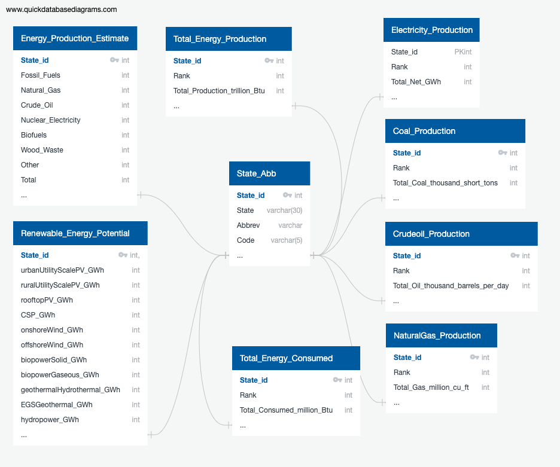

# ETL_Project

Extract, transform and load energy data 'US Engergy Production & consumption' using python sqlalchemy and PostgreSQL

Data sources: CSV files from following sources
  
    * https://www.eia.gov/
    
    * https://data.world/

Summary of the data:
  * Annual energy consumption values
  * Energy consumption/production by Coal, Crude Oil, Natural Gas, & Electricity
  * Potential for renwalble engergy per state
  
Type of database to load Data:
  * CSV data
  * SQL database
    * Adding State_id as primary key
    
  

Team Members: Eunjeong Lee, Niral Patel, Bill Pezzullo, Tashanee Williams

